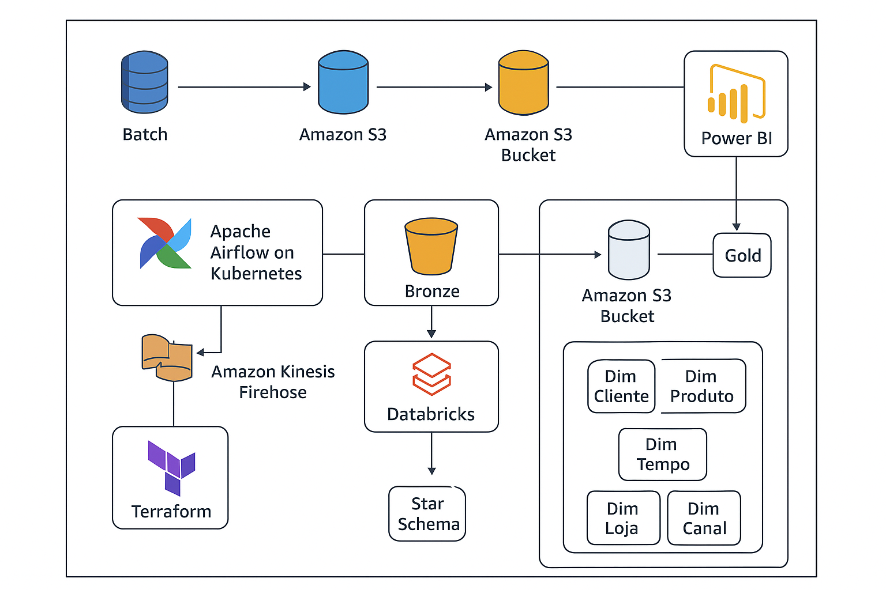

## Visão Geral
Este projeto implementa uma plataforma moderna de engenharia de dados para um e-commerce que integra informações de vendas online, lojas físicas e interações de usuários em tempo real.

A arquitetura foi construída sobre serviços da AWS, com Apache Airflow para orquestração, Databricks para processamento de dados, Terraform para IaC, Kubernetes (EKS) para escalabilidade e Power BI para consumo de relatórios e dashboards.
## Objetivos
- Ingestão de dados batch (ERP, CRM, RDS).
- Ingestão de dados streaming (eventos de site/app em tempo real).
- Construção de um Data Lakehouse baseado em camadas Bronze, Prata e Ouro.
- Modelo dimensional (Star Schema) para análise de negócios.
- Visualização e análise dos dados no Power BI.
- Infraestrutura provisionada e gerenciada via Terraform.
- Orquestração resiliente via Airflow em Kubernetes.
## Tecnologias
Ingestão de Dados
- Batch:
 - AWS RDS (MySQL/Postgres) – dados transacionais.
 - Arquivos CSV/Parquet – importados via S3.
 - Airflow (EKS) – orquestra jobs ETL de ingestão em lote.
- Streaming:
 - AWS Kinesis Data Streams – eventos de clique, navegação e carrinho.
 - AWS Kinesis Firehose – grava dados crus no S3 (Bronze) e envia para Databricks.
## Arquitetura

## Documentações Utilizadas
#
#
#

## Overview
## Objectives
## Technologies
## Architecture

## Documentation Used